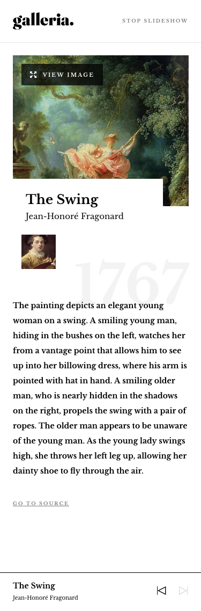
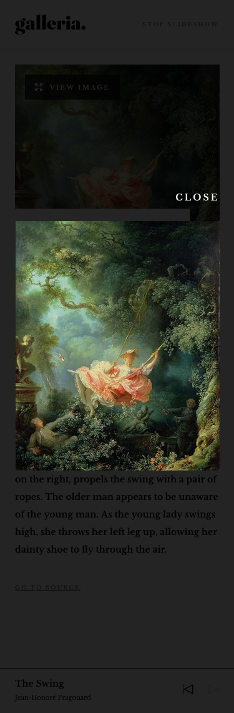

# Frontend Mentor - Galleria slideshow site solution

This is a solution to the [Galleria slideshow site challenge on Frontend Mentor](https://www.frontendmentor.io/challenges/galleria-slideshow-site-tEA4pwsa6). Frontend Mentor challenges help you improve your coding skills by building realistic projects.

## Table of contents

- [Overview](#overview)
  - [The challenge](#the-challenge)
  - [Screenshot](#screenshot)
  - [Links](#links)
- [My process](#my-process)
  - [Built with](#built-with)
  - [What I learned](#what-i-learned)
  - [Continued development](#continued-development)
  - [Useful resources](#useful-resources)
- [Author](#author)

**Note: Delete this note and update the table of contents based on what sections you keep.**

## Overview

### The challenge

Users should be able to:

- View the optimal layout for the app depending on their device's screen size
- See hover states for all interactive elements on the page
- Navigate the slideshow and view each painting in a lightbox

### Screenshot

### Links

- Solution URL: [Frontend Mentor](https://www.frontendmentor.io/solutions/responsive-design-wtouch-control-animations-react-scss-css-grid-yuO5KgNhEv)
- Live Site URL: [GitHub](https://anglicus.github.io/fem_galleria-slideshow/)

## My process

### Built with

- Semantic HTML5 markup
- Flexbox
- CSS Grid
- Mobile-first workflow
- [React](https://reactjs.org/)

### What I learned

This project seemed simple on the surface, but it had some challenging aspects to the design. I also learned about incorporating animations and touch control into my React app.

### Continued development

I want to keep going with React for a while so I can learn in thoroughly.

### Useful resources

- [Demaspira Aulia on Dev.to](https://dev.to/rakumairu/how-to-handle-swipe-event-on-react-carousel-24ab) - Alhough I didn't follow this entire example, the section on using touch to swipe left and right through pages was very helpful.

## Author

- GitHub - [@anglicus](https://github.com/anglicus)
- Frontend Mentor - [@anglicus](https://www.frontendmentor.io/profile/anglicus)
- FreeCodeCamp [@anglicus] (https://www.freecodecamp.org/anglicus)
- Codepen - [@anglicus](https://codepen.io/anglicus)
